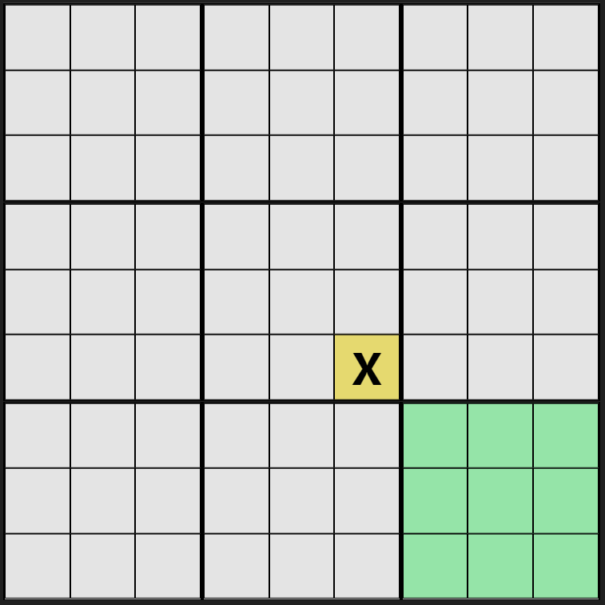
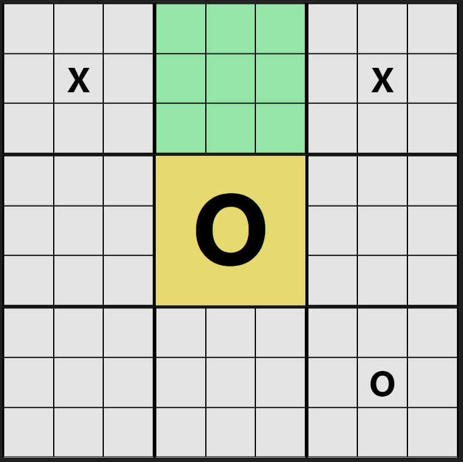
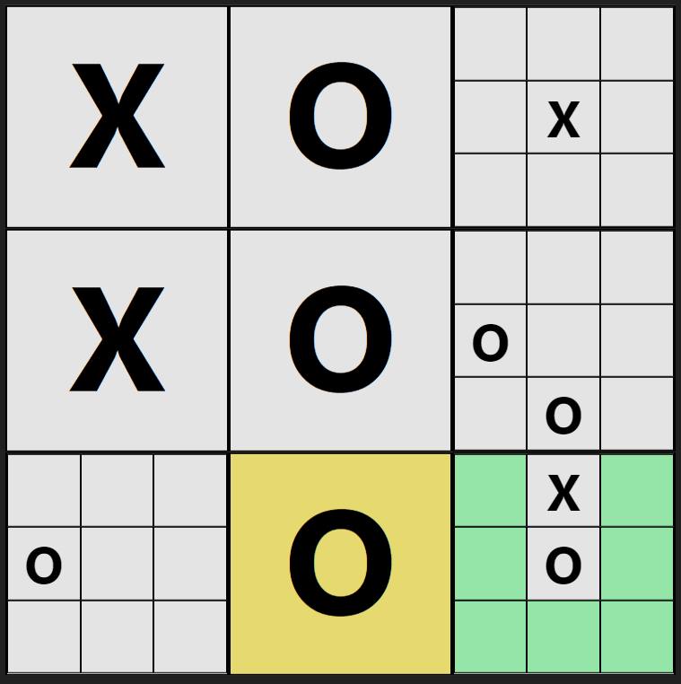

# Super Tic Tac Toe 

## I- Introduction

Super Tic Tac Toe is a game that is an advanced version of the classic Tic Tac Toe game. You can find the rules of the game [here](#iv--rules). In this repository, you will find all the files to host the game yourself on a server.

## II- Installation

To install the game, you need to serve the build folder with a web server surch as [Apache](https://httpd.apache.org/) or [Nginx](https://www.nginx.com/). 

Then, you need to run the following command to install the dependencies:

```bash
npm install 
```

You also need to serve the server.js file with node : 
```bash
node server.js
```

The connection between players is made thanks to [socket.io](https://socket.io/docs/) running on port `$PORT`. So you will need to open your firewall to redirect request from this port on your server.

For now, you will need to hardcode the IP address of your server in the client.js file. You can do that by searching `$IP_ADRESS:PORT` in the `main.0561b073.chunk.js` and replacing it by your own 

## III- Options

You have multiple options to play the game
1. You can play on a single screen with a friend choosing the "1 player" option
2. You can play on 2 different screens by choosing the "2 players" option and then sharing the link with your friend

> :warning:
> **If you leave the page, you won't be able to join back the game again while keeping the game progress. You will need to start a new game.**

> :bulb:
> You can start a new game at anytime by pressing the reset button
## IV- Rules
1. Players play in turns
2. For the first turn, the first player can place his symbol anywhere on the board
3. For the next turns, the player can only place his symbol on the board corresponding to the square where his opponent placed his symbol on the previous turn. (*ie*: The previous player played on the bottom right square of the middle board so the next player have to play on bottom right board)


<p style="text-align:center"> </img></p>

4. If a player have to play on a board that is already won, he can play on any board
5. When you align 3 symbols on a board, you win the board.
   
<p style="text-align:center"> </img></p>

6. If you align 3 winning board, you win the game. 

<p style="text-align:center"> </img></p>